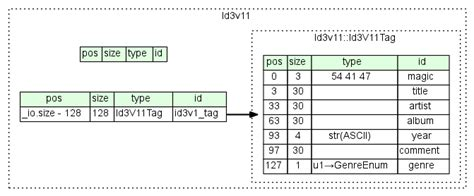

# README.md
This program handles file metadata in the context of an MP3 player according to one common file standard, and allows for sorting, managing a queue, and viewing the information stored in metadata.
## File Layout
The Music/ directory contains subdirectories representing albums and playlists, as well as individual .mp3 files. Each album and playlist should contain a list of .mp3 files as well.
Each .mp3 file included is a real playable .mp3, feel free to open it in VLC or any mp3 player, just please don't sue me, it's necessary for the demo. These mp3 files are tagged following the [ID3v1](https://id3.org/ID3v1) specification, this is standard metadata tagging for mp3 files, however it is the old spec, so if you add your own mp3 files, ensure they're tagged according to ID3v1 rather than v2.



If you want to move the Music/ directory elsewhere, change the variable base_dir in Interface.java, similar goes for running it from another directory.

## Building and Running Program
The program can be compiled and run from the MusicLibrary directory with
```bash
javac ./*.java && java Interface
```
Alternatively, to download and run
```bash
git clone https://github.com/m33ls/CIST4B1_AdvJava
cd CIST4B1_AdvJava/Homework/MusicLibrary/
javac ./*.java && java Interface
```
Type help to list out the available commands, and it should be fairly self-explanatory and robust. 

## Troubleshooting
For troubleshooting purposes, here's the info for my system, on which it compiles.
```
[amelia@archlinux ~]$ uname -a
Linux archlinux 6.18.5-arch1-1 #1 SMP PREEMPT_DYNAMIC Sun, 11 Jan 2026 17:10:53 +0000 x86_64 GNU/Linux
[amelia@archlinux ~]$ java --version
openjdk 25.0.1 2025-10-21
OpenJDK Runtime Environment (build 25.0.1)
OpenJDK 64-Bit Server VM (build 25.0.1, mixed mode, sharing)
[amelia@archlinux ~]$ 
```